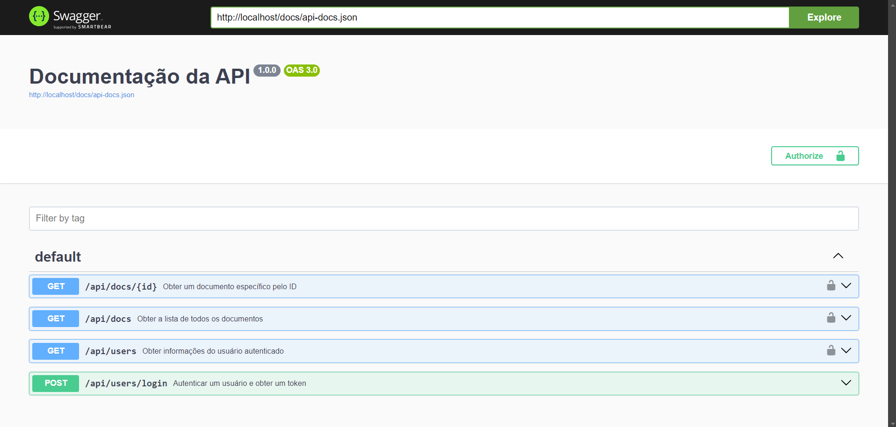
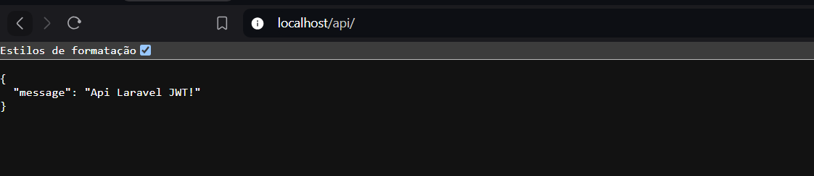
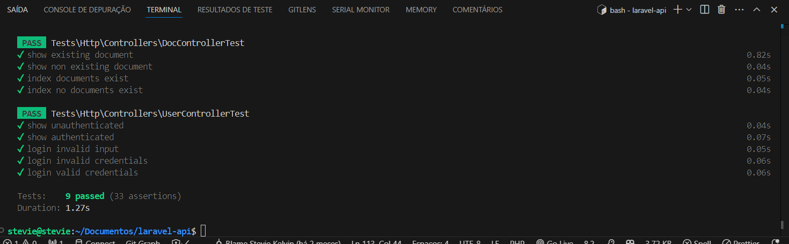

# Backend API

Bem-vindo ao **Backend API**! Este projeto oferece funcionalidades de autenticação e acesso a documentos.

## Instalação

1. **Clone o projeto:**

    ```bash
        git clone https://github.com/steviekelvin/laravel-api.git
    ```

2. **Navegue até a raiz do projeto:**

    ```bash
        cd laravel-api
    ```

3. **Instale as dependências do sistema:**

    ```bash
        sudo apt-get update
        sudo apt-get install php-xml php-curl
    ```

4. **Instale as dependências do projeto:**

    ```bash
        composer install
    ```

5. **Configure o ambiente:**

    - Copie o arquivo `.env.example` para `.env`:

        ```bash
            cp .env.example .env
        ```

    - Configure um alias para comandos Sail (opcional):

        ```bash
            alias sail='sh $([ -f sail ] && echo sail || echo vendor/bin/sail)'
        ```

6. **Suba o projeto:**

    ```bash
        sail up
    ```

7. **Gere a chave da aplicação e o segredo JWT:**

    ```bash
        sail php artisan key:generate
        sail php artisan jwt:secret
        sail php artisan config:clear
    ```

8. **Copie do arquivo `.env` para `.env.testing` as variáveis:**
   JWT_SECRET e APP_KEY

9. **Gere os dados iniciais no banco de dados:**

    ```bash
        sail php artisan migrate:fresh --seed
    ```

### Autenticação

- **Login via Email e Senha**

  - **Endpoint:** `/api/users/login`
  - **Método:** `POST`
  - **Descrição:** Autentica um usuário com email e senha.
  - **Body:**

    ```json
    {
        "email": "steviekelvinsilvabarbosa4@gmail.com", 
        "password": "12345678"
    }
    ```

  - **Resposta:** Retorna um token JWT para autenticação.

- **Login via Token JWT**

  - **Endpoint:** `/api/users/`
  - **Método:** `GET`
  - **Descrição:** Autentica um usuário com Bearer Token
  - **Retorno:** Retorna o objeto de usuário logado com o token

### Documentos

- **Lista de Documentos**

  - **Endpoint:** `/api/docs/`
  - **Método:** `GET`
  - **Descrição:** Obtém a lista completa de todos os documentos.
  - **Autenticação:** Necessário Bearer Token JWT

- **Documento por ID**

  - **Endpoint:** `/api/docs/{id}`
  - **Método:** `GET`
  - **Descrição:** Retorna o documento com o ID especificado.
  - **Autenticação:** Necessário Bearer Token JWT

Para acessar rotas que requerem autenticação, inclua um token JWT válido no cabeçalho da solicitação:

```http
    Authorization: Bearer seu_token_jwt
```

## Swagger

Para acessar o swagger da aplicação basta acessar o [http://localhost/api/documentation](http://localhost/api/documentation)

## Testes

- Confira se realmente os dados do passo 7 e 8 foram executados corretamente

```bash
    sail php artisan test
```

- Testes indivíduais

Usuário:

```bash
    sail php artisan test --filter=testShowExistingDocument
    sail php artisan test --filter=testShowNonExistingDocument
    sail php artisan test --filter=testIndexDocumentsExist
    sail php artisan test --filter=testIndexNoDocumentsExist
```

Documentos:

```bash
    sail php artisan test --filter=testShowExistingDocument
    sail php artisan test --filter=testShowNonExistingDocument
    sail php artisan test --filter=testIndexDocumentsExist
    sail php artisan test --filter=testIndexNoDocumentsExist
```


## Insomia

Arquivo de testes por insomia inclusos na raiz do projeto





